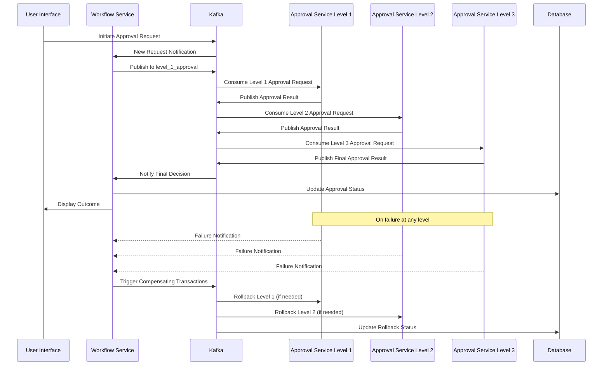
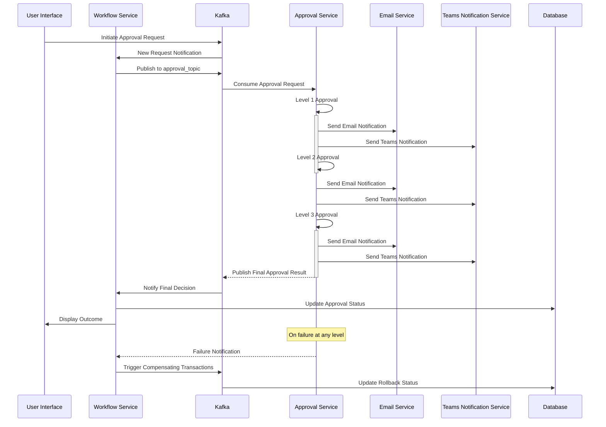
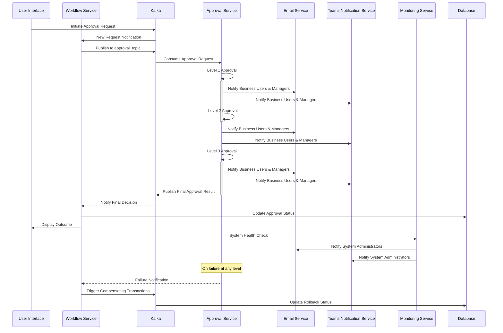
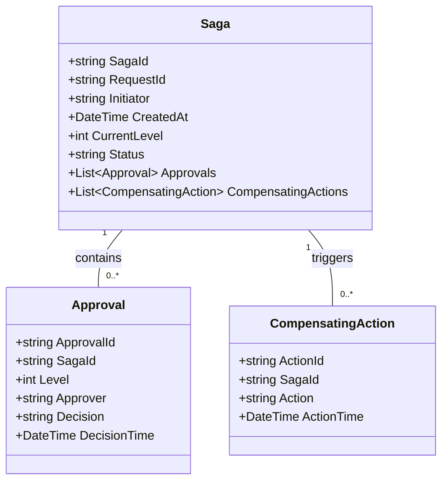
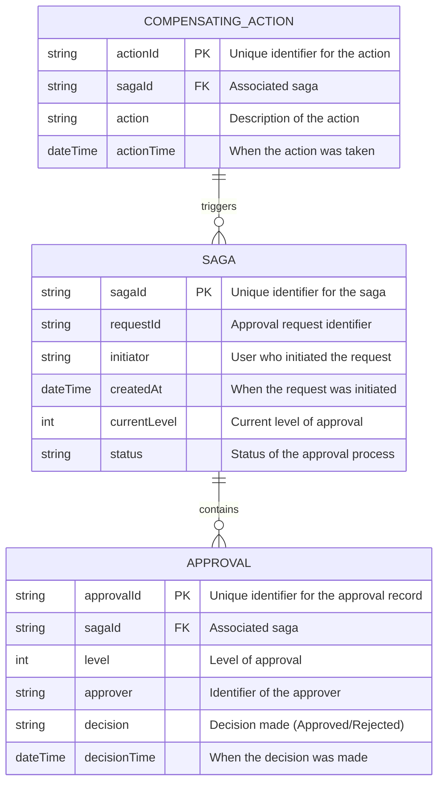

# A conversation with Chat-GPT about designing an approval workflow in Kafka

## Summary:
The following document is a refined transcript of a conversation that Eric Ziko had with Chat-GPT about designing an approval workflow so
ftware system.

## Table Of Contents

- [A conversation with Chat-GPT about designing an approval workflow in Kafka](#a-conversation-with-chat-gpt-about-designing-an-approval-workflow-in-kafka)
  - [Summary:](#summary)
  - [Table Of Contents](#table-of-contents)
  - [A conversation with Chat-GPT about designing an approval workflow in Kafka](#a-conversation-with-chat-gpt-about-designing-an-approval-workflow-in-kafka-1)
    - [Approvals WorkFlow Kafka Design](#approvals-workflow-kafka-design)
      - [1. Overview](#1-overview)
      - [2. System Architecture](#2-system-architecture)
        - [**2.1 Components**](#21-components)
        - [**2.2 Kafka Topics**](#22-kafka-topics)
      - [3. Workflow Design](#3-workflow-design)
        - [**3.1 Process Flow**](#31-process-flow)
        - [**3.2 Saga Orchestration**](#32-saga-orchestration)
      - [4. Error Handling and Compensation](#4-error-handling-and-compensation)
      - [5. Data Model](#5-data-model)
      - [6. Performance Considerations](#6-performance-considerations)
      - [7. Security and Compliance](#7-security-and-compliance)
      - [8. Technology Stack](#8-technology-stack)
      - [9. Testing Strategy](#9-testing-strategy)
      - [10. Deployment and Maintenance](#10-deployment-and-maintenance)
      - [Conclusion](#conclusion)
    - [Sequence diagram v1](#sequence-diagram-v1)
    - [Sequence Diagram v2](#sequence-diagram-v2)
    - [Sequence Diagram v3](#sequence-diagram-v3)
    - [Saga JSON Schema](#saga-json-schema)
    - [Class diagram for Saga](#class-diagram-for-saga)
    - [C# Saga Code](#c-saga-code)
      - [Class Explanation:](#class-explanation)
      - [Usage:](#usage)
    - [User Stories V1](#user-stories-v1)
      - [**User Story: Submitting Approval Requests**](#user-story-submitting-approval-requests)
      - [**User Story: Viewing Approval Request Status**](#user-story-viewing-approval-request-status)
      - [**User Story: Approving Requests**](#user-story-approving-requests)
      - [**User Story: Receiving Email Notifications**](#user-story-receiving-email-notifications)
      - [**User Story: Receiving Microsoft Teams Notifications**](#user-story-receiving-microsoft-teams-notifications)
      - [**User Story: Handling Approval Workflow Failures**](#user-story-handling-approval-workflow-failures)
      - [**User Story: Monitoring System Health**](#user-story-monitoring-system-health)
      - [**User Story: Managing Approval Workflow Saga**](#user-story-managing-approval-workflow-saga)
      - [**User Story: Rolling Back Transactions**](#user-story-rolling-back-transactions)
      - [**User Story: Accessing Historical Approval Data**](#user-story-accessing-historical-approval-data)
    - [User Stories with Definitions of Done and Test Cases](#user-stories-with-definitions-of-done-and-test-cases)
      - [**User Story: Submitting Approval Requests**](#user-story-submitting-approval-requests-1)
      - [**User Story: Viewing Approval Request Status**](#user-story-viewing-approval-request-status-1)
      - [**User Story: Approving Requests**](#user-story-approving-requests-1)
      - [**User Story: Receiving Email Notifications**](#user-story-receiving-email-notifications-1)
      - [**User Story: Receiving Microsoft Teams Notifications**](#user-story-receiving-microsoft-teams-notifications-1)
      - [**User Story: Handling Approval Workflow Failures**](#user-story-handling-approval-workflow-failures-1)
      - [**User Story: Monitoring System Health**](#user-story-monitoring-system-health-1)
      - [**User Story: Managing Approval Workflow Saga**](#user-story-managing-approval-workflow-saga-1)
      - [**User Story: Rolling Back Transactions**](#user-story-rolling-back-transactions-1)
      - [**User Story: Accessing Historical Approval Data**](#user-story-accessing-historical-approval-data-1)
    - [Development time estimate](#development-time-estimate)
      - [Factors to Consider](#factors-to-consider)
      - [Rough Time Estimates](#rough-time-estimates)
    - [Approvals WorkFlow Kafka Design DB Schema](#approvals-workflow-kafka-design-db-schema)
    - [T-SQL For Database Schema V1](#t-sql-for-database-schema-v1)
    - [T-SQL for database schema V2](#t-sql-for-database-schema-v2)
    - [Executive Summary - Approval Workflow System Design](#executive-summary---approval-workflow-system-design)
      - [Overview](#overview)
      - [System Architecture](#system-architecture)
      - [Key Features](#key-features)
      - [Technical Specifications](#technical-specifications)
      - [Development Scope](#development-scope)
      - [Conclusion](#conclusion-1)
    - [Executive Summary - for a 4 year old](#executive-summary---for-a-4-year-old)
    - [Logo Design for system](#logo-design-for-system)


## A conversation with Chat-GPT about designing an approval workflow in Kafka

> **Eric Ziko**  
> Write me a design document for an approval workflow using sagas with 3 levels of approvals required  
  
> **Chat-GPT**  
> Creating a design document for an approval workflow using the saga pattern with three levels of approvals requires careful planning and consideration of several factors. 
> This document will outline the key components, data flow, and error handling strategies. We'll use Apache Kafka for messaging and orchestration of sagas, 
> and C# as the programming language for the implementation.  
### Approvals WorkFlow Kafka Design  

#### 1. Overview  

**Purpose**: Design an approval workflow system that requires three levels of approvals for processing certain transactions or requests, utilizing the saga pattern for managing distributed transactions.  
**Scope**: The workflow will manage approvals across different departments or levels, ensuring each step is completed before moving to the next. It will handle failures and rollback scenarios effectively.  
#### 2. System Architecture  
##### **2.1 Components**  
-   **Front-end Application**: Interface for initiating approval requests.  
-   **Workflow Service**: Core service that manages the approval process.  
-   **Kafka Brokers**: Messaging system for communication between services.  
-   **Approval Services**: Three distinct services representing each level of approval.  
-   **Database**: Stores approval states and transaction logs.  
##### **2.2 Kafka Topics**  
-   `approval_requests`: For initiating new approval requests.  
-   `level_1_approval`, `level_2_approval`, `level_3_approval`: For each approval level.  
-   `approval_outcome`: To communicate the final decision.    
#### 3. Workflow Design  
##### **3.1 Process Flow**  
1.  **Initiation**: A request is initiated from the front-end and sent to the `approval_requests` topic.  
2.  **Level 1 Approval**: Consumed by the first approval service. On approval, it publishes to `level_2_approval`.  
3.  **Level 2 Approval**: Similar to Level 1. On approval, it publishes to `level_3_approval`.  
4.  **Level 3 Approval**: Final approval step. On approval, it publishes to `approval_outcome`.  
5.  **Completion**: The outcome is consumed by the Workflow Service and the result is updated in the database.  
##### **3.2 Saga Orchestration**  
-   Each step in the approval process is a local transaction.  
-   On failure at any level, compensating transactions are triggered to rollback previous steps.  
-   The Workflow Service listens to all approval topics to track the process and manage sagas.  
#### 4. Error Handling and Compensation  
-   **Timeouts and Failures**: If an approval service fails to respond within a set time, the Workflow Service will trigger a compensating transaction.  
-   **Compensating Transactions**: These are custom defined for each approval level to appropriately rollback changes.  
-   **Retry Mechanisms**: Implement retries with exponential backoff for transient errors.  
#### 5. Data Model  
-   **ApprovalRequest**: `{ RequestId, Initiator, Timestamp, Status, ... }`  
-   **ApprovalResponse**: `{ RequestId, Approver, Level, Decision, Timestamp, ... }`  
#### 6. Performance Considerations  
-   **Throughput and Scalability**: Kafka brokers should be configured for high throughput. Partitioning topics by request ID can aid in scalability.  
-   **Load Balancing**: Approval services should be load balanced to handle high volumes of requests.  
-   **Monitoring and Logging**: Implement comprehensive logging for tracking and debugging. Use Kafka's monitoring tools to observe system health.  
#### 7. Security and Compliance  
-   **Data Encryption**: Encrypt sensitive data in transit and at rest.  
-   **Access Control**: Implement strict access controls for each service, ensuring only authorized personnel can approve at each level.  
-   **Audit Trails**: Maintain detailed logs for compliance and auditing purposes.  
#### 8. Technology Stack  
-   **Backend**: C# for service implementation.  
-   **Messaging**: Apache Kafka for inter-service communication.  
-   **Database**: Choose an appropriate database like SQL Server for transactional data.  
#### 9. Testing Strategy  
-   **Unit Testing**: For individual components.  
-   **Integration Testing**: To test the interaction between components, especially with Kafka.  
-   **End-to-End Testing**: Simulate real-world scenarios to test the entire workflow.  
-   **Load Testing**: To ensure the system performs under high load.  
#### 10. Deployment and Maintenance  
-   **Containerization**: Use Docker for containerization of services.  
-   **Continuous Integration/Continuous Deployment (CI/CD)**: Automate deployment processes.  
-   **Monitoring and Alerting**: Implement monitoring for real-time alerting and system health checks.  
#### Conclusion  
This design document provides a blueprint for implementing a robust, scalable, and secure approval workflow using the saga pattern with Kafka and C#. The system ensures reliable processing of multi-level approvals with adequate error handling and compensation mechanisms.  
### Sequence diagram v1
> **Eric Ziko**  
> Can you create a sequence diagram in mermaid describing this system?  
  
> **Chat-GPT**  
> Approvals WorkFlow Kafka Design  
  
Certainly, a sequence diagram can effectively illustrate the interactions between different components in the approval workflow system. Given the complexity of the system, 
I'll create a simplified version focusing on key interactions. Since I can't directly generate images, 
I'll provide you with the Mermaid code which you can use in a Mermaid-compatible renderer to visualize the diagram.  
  
Here's the Mermaid sequence diagram code:  
  

  
In this updated diagram, the `Approval Service (AS)` is now responsible for handling all three levels of approval. 
It consumes the approval request from Kafka, processes each level of approval sequentially, and then publishes the final approval result back to Kafka. 
The Workflow Service (`WS`) then updates the final decision in the Database (`DB`) and notifies the User Interface (`UI`).  
  
This revised diagram simplifies the original workflow by consolidating the approval process into a single service, which may be advantageous for systems with less complex approval criteria or where centralized control is preferred.  
### Sequence Diagram v2

> **Eric Ziko**  
> The users want to be notified of pending approvals via email and Microsoft teams, can you add that to the sequence diagram?  
   
> **Chat-GPT**  
> Approvals WorkFlow Kafka Design  
  
Absolutely, I can incorporate email and Microsoft Teams notifications for pending approvals into the sequence diagram. Here's the updated Mermaid code reflecting these changes:  
  

  
In this version, after each level of approval in the `Approval Service (AS)`, there are additional steps where the service sends notifications through both the `Email Service` and the `Microsoft Teams Notification Service`. This ensures that relevant users or approvers are notified about pending approvals via their preferred communication channels.  
  
This enhancement is aimed at improving the user experience by keeping them informed and engaged throughout the approval process.  
### Sequence Diagram v3

> **Eric Ziko**  
> We have three different types of users, [Business Users], [Managers] and [System Administrators]. The [System Administrators] are only interested in notifications regarding the operational health of the system. 
> The [Business Users] and [Managers] are interested in being notified of necessary approvals. Can you factor this information into the above sequence diagram?  

> **Chat-GPT**  
> Approvals WorkFlow Kafka Design  

Certainly! To incorporate the different notification preferences for "Business Users", "Managers", and "System Administrators" into the sequence diagram, I'll update the interactions with the Email and Teams Notification Services. I'll also add a Monitoring Service to handle notifications related to the operational health of the system, specifically for "System Administrators".  
  
Here's the updated Mermaid sequence diagram code:  
  

  
In this version, the `Approval Service (AS)` sends notifications to `Business Users` and `Managers` through the `Email Service` and `Teams Notification Service` at each level of approval. Additionally, the `Workflow Service (WS)` periodically checks the system's health and sends operational health notifications to `System Administrators` via the `Monitoring Service`, which then communicates with the `Email` and `Teams Notification Services`.  
  
This modification ensures that different user groups receive relevant notifications, enhancing the overall efficiency and user experience of the system.  
### Saga JSON Schema

> **Eric Ziko**
> Can you design a schema in JSON for me of the Saga that we need to implement for this system?  
  
> **Chat-GPT**  
> Certainly! Designing a JSON schema for the Saga that orchestrates the approval workflow in this system involves outlining the structure and data types of the saga state. This state will track the progress of the approval process through its various stages and handle compensating actions if necessary.  
  
Here's an example of a JSON schema for the Saga:  
```json  
{  
  "$schema": "http://json-schema.org/draft-07/schema#",  
  "title": "ApprovalWorkflowSaga",  
  "type": "object",  
  "properties": {  
    "sagaId": {  
      "type": "string",  
      "description": "Unique identifier for the saga instance."  
    },  
    "requestId": {  
      "type": "string",  
      "description": "Identifier for the approval request."  
    },  
    "initiator": {  
      "type": "string",  
      "description": "The user who initiated the approval request."  
    },  
    "createdAt": {  
      "type": "string",  
      "format": "date-time",  
      "description": "The date and time when the request was initiated."  
    },  
    "currentLevel": {  
      "type": "integer",  
      "description": "The current level of approval the request is at."  
    },  
    "status": {  
      "type": "string",  
      "enum": ["Pending", "Approved", "Rejected", "Failed"],  
      "description": "Current status of the approval process."  
    },  
    "approvals": {  
      "type": "array",  
      "items": {  
        "type": "object",  
        "properties": {  
          "level": {  
            "type": "integer",  
            "description": "The level of approval."  
          },  
          "approver": {  
            "type": "string",  
            "description": "Identifier of the approver."  
          },  
          "decision": {  
            "type": "string",  
            "enum": ["Approved", "Rejected"],  
            "description": "Decision made by the approver."  
          },  
          "decisionTime": {  
            "type": "string",  
            "format": "date-time",  
            "description": "The date and time when the decision was made."  
          }  
        },  
        "required": ["level", "approver", "decision", "decisionTime"]  
      },  
      "description": "List of approvals/rejections at each level."  
    },  
    "compensatingActions": {  
      "type": "array",  
      "items": {  
        "type": "object",  
        "properties": {  
          "action": {  
            "type": "string",  
            "description": "The compensating action taken."  
          },  
          "actionTime": {  
            "type": "string",  
            "format": "date-time",  
            "description": "The date and time when the action was taken."  
          }  
        },  
        "required": ["action", "actionTime"]  
      },  
      "description": "List of compensating actions taken in case of failure."  
    }  
  },  
  "required": ["sagaId", "requestId", "initiator", "createdAt", "currentLevel", "status"]  
}  
  
```  
  
This JSON schema outlines the structure of the saga's state, including:
- **Saga Identification**: Unique identifiers for the saga instance and the associated approval request.  
- **Initiation Details**: Information about who initiated the request and when.  
- **Approval Process Tracking**: Current approval level, overall status, and detailed information about decisions made at each level.  
- **Compensating Actions**: Records of any compensating actions taken in response to failures or rejections.  

### Class diagram for Saga

> **Eric Ziko**
> Can you draw me a class diagram in mermaid for the schema of that saga

> **Chat-GPT**
> Certainly! Below is a class diagram in Mermaid syntax that represents the schema of the saga based on the database tables `Saga`, `Approval`, and `CompensatingAction`. This class diagram will illustrate the structure of the corresponding classes that might be used in a C# application to interact with the database.



This schema will help in persisting and tracking the state of each approval request as it moves through the workflow, ensuring robust saga management and facilitating error handling and recovery.  

### C# Saga Code

> **Eric Ziko**
> Can you generate some c# code for the classes in the saga?

> **Chat-GPT**
> Certainly! Below is an example of C# code for the classes corresponding to the `Saga`, `Approval`, and `CompensatingAction` entities in the saga schema. 
> These classes are designed to reflect the structure and relationships indicated in the class diagram.

```csharp
using System;
using System.Collections.Generic;

public class Saga {
    public string SagaId { get; set; }
    public string RequestId { get; set; }
    public string Initiator { get; set; }
    public DateTime CreatedAt { get; set; }
    public int CurrentLevel { get; set; }
    public string Status { get; set; }

    // Navigation properties
    public List<Approval> Approvals { get; set; }
    public List<CompensatingAction> CompensatingActions { get; set; }

    public Saga(){
        Approvals = new List<Approval>();
        CompensatingActions = new List<CompensatingAction>();
    }
}

public class Approval {
    public string ApprovalId { get; set; }
    public string SagaId { get; set; }
    public int Level { get; set; }
    public string Approver { get; set; }
    public string Decision { get; set; }
    public DateTime DecisionTime { get; set; }

    // Navigation property
    public Saga Saga { get; set; }
}

public class CompensatingAction {
    public string ActionId { get; set; }
    public string SagaId { get; set; }
    public string Action { get; set; }
    public DateTime ActionTime { get; set; }

    // Navigation property
    public Saga Saga { get; set; }
}
```

#### Class Explanation:
- **Saga Class**: Represents the saga with properties corresponding to the database columns. It includes navigation properties to `Approval` and `CompensatingAction` objects.
- **Approval Class**: Maps to an individual approval record. Includes a navigation property back to the `Saga` class.
- **CompensatingAction Class**: Represents compensating actions taken. Also includes a navigation property to the `Saga` class.
#### Usage:
These classes can be used with an ORM (Object-Relational Mapper) like Entity Framework in a C# application to interact with the corresponding database tables. The navigation properties enable easy traversal of related data in an object-oriented manner.

**Note:** Depending on your specific implementation and ORM configuration, you might need to adjust these classes, especially in terms of navigation properties and lazy loading behavior.
### User Stories V1

> **Eric Ziko**
> Can you generate a list of user stories that I need to generate as for the requirements so far?  

> **Chat-GPT**
> Certainly! Based on the requirements and features discussed for the approval workflow system, here's a list of user stories. 
> These stories cover various aspects of the system, including the user interface, approval process, notifications, and system administration.  
#### **User Story: Submitting Approval Requests**  
- As a Business User,  
- I want to submit approval requests through the User Interface,  
- So that they can be processed according to the approval workflow.  
#### **User Story: Viewing Approval Request Status**  
- As a Business User or Manager,  
- I want to view the status of my submitted approval requests,  
- So that I can track their progress through the approval levels.  
#### **User Story: Approving Requests**  
 - As a Manager,  
 - I want to approve or reject requests assigned to my level,  
 - So that the workflow can proceed or be halted based on my decision.  
#### **User Story: Receiving Email Notifications**
- As a Business User or Manager,  
- I want to receive email notifications for pending approvals,  
- So that I am informed and can take timely action on approvals.  
#### **User Story: Receiving Microsoft Teams Notifications**  
- As a Business User or Manager,  
- I want to receive Microsoft Teams notifications for pending approvals,  
- So that I am promptly informed within my preferred communication tool.  
#### **User Story: Handling Approval Workflow Failures**  
- As a System Administrator,  
- I want to be notified of any operational failures in the approval workflow,  
- So that I can take immediate action to resolve any issues.  
#### **User Story: Monitoring System Health**
- As a System Administrator,  
- I want to monitor the operational health of the approval workflow system,  
- To ensure its continuous and efficient functioning.
#### **User Story: Managing Approval Workflow Saga**  
- As a Workflow Service,  
- I need to manage the saga lifecycle of each approval request,  
#### **User Story: Rolling Back Transactions**
- As a Workflow Service,  
- I want to trigger compensating transactions in case of approval process failures,  
- To maintain data consistency and revert any intermediate changes.  
#### **User Story: Accessing Historical Approval Data**  
- As a Manager or System Administrator,  
- I want to access historical data of approval requests,  
- So that I can audit and review past activities for compliance and analysis.  
  
These user stories encapsulate the key functionalities and interactions within the approval workflow system, providing a clear roadmap for development and ensuring that all critical requirements are addressed.  

### User Stories with Definitions of Done and Test Cases  
  
> **Eric Ziko**  
> Can you re-generate the above user stories with "definition of done" for each one and a list of test cases for each user story?  

> **Chat-GPT**  
> Certainly! I'll add a "Definition of Done" for each user story and a list of relevant test cases to ensure clarity and thoroughness in implementation and testing.  
#### **User Story: Submitting Approval Requests**  
  - **Definition of Done**:  
    - Users can successfully submit approval requests through the UI.  
    - The system records and acknowledges each request submission.  
  - **Test Cases**:  
    - Submit an approval request with valid data and verify it is recorded.  
    - Attempt to submit a request with invalid data and ensure it is rejected.  
#### **User Story: Viewing Approval Request Status**  
  - **Definition of Done**:  
    - Users can view the status of their approval requests in real-time.  
    - The UI accurately reflects the current status of each request.  
  - **Test Cases**:  
    - Check if the status of a newly submitted request is shown as "Pending".  
    - Verify that status updates (e.g., "Approved", "Rejected") are reflected promptly.  
#### **User Story: Approving Requests**  
  - **Definition of Done**:  
    - Managers can approve or reject requests.  
    - Approved or rejected requests proceed to the next step or are halted, respectively.  
  - **Test Cases**:  
    - Approve a request and verify it moves to the next level.  
    - Reject a request and ensure it does not proceed further.  
#### **User Story: Receiving Email Notifications**  
  - **Definition of Done**:  
    - Email notifications are sent for pending approvals.  
    - Notifications contain relevant details about the approval request.  
  - **Test Cases**:  
    - Trigger a pending approval and verify an email is sent.  
    - Check the content of the email for accuracy and completeness.  
#### **User Story: Receiving Microsoft Teams Notifications**  
  - **Definition of Done**:  
    - Teams notifications are sent for pending approvals.  
    - Notifications are timely and contain essential request details.  
  - **Test Cases**:  
    - Trigger a pending approval and verify a Teams notification is sent.  
    - Evaluate the notification's timing and content for accuracy.  
#### **User Story: Handling Approval Workflow Failures**  
  - **Definition of Done**:  
    - System Administrators receive notifications of workflow failures.  
    - Administrators have enough information to identify and address the issue.  
  - **Test Cases**:  
    - Simulate a failure in the workflow and ensure a notification is sent.  
    - Check the notification for detailed failure information.  
#### **User Story: Monitoring System Health**  
  - **Definition of Done**:  
    - Continuous monitoring of system health is implemented.  
    - Relevant metrics and alerts are available to System Administrators.  
  - **Test Cases**:  
    - Verify that system health metrics are being recorded.  
    - Test the alerting mechanism by simulating a health threshold breach.  
#### **User Story: Managing Approval Workflow Saga**  
  - **Definition of Done**:  
    - The Workflow Service correctly manages the saga lifecycle for each request.  
    - The saga state reflects the accurate status of the approval process.  
  - **Test Cases**:  
    - Track a request's saga state throughout the approval process for consistency.  
    - Introduce an error and ensure the saga state reflects the failure correctly.  
#### **User Story: Rolling Back Transactions**  
  - **Definition of Done**:  
    - Compensating transactions are triggered in case of process failures.  
    - Rollbacks maintain data consistency and revert intermediate changes.  
  - **Test Cases**:  
    - Trigger a failure at a certain approval level and verify rollback is executed.  
    - Check data consistency post-rollback.  
#### **User Story: Accessing Historical Approval Data**  
  - **Definition of Done**:  
    - Historical data of approval requests is accessible for review and audit.  
    - Data includes comprehensive details of each request and its journey.  
  - **Test Cases**:  
    - Retrieve the historical data of a completed request and verify its accuracy.  
    - Test access controls to ensure only authorized users can view historical data.  
  
Each "Definition of Done" ensures that the user story meets its intended outcome, while the test cases provide a clear path for verifying the functionality and robustness of each feature.  
  
### Development time estimate
  
> **Eric Ziko**  
> How long do you estimate it would take to develop the system I have described?  
   
> **Chat-GPT**  
> Approvals WorkFlow Kafka Design  
  
Estimating the development time for the described system involves considering several factors, including the complexity of the system, the experience and size of the development team, existing infrastructure, and the tools and technologies involved. Here's a rough estimation based on typical scenarios:  
#### Factors to Consider  
1. **System Complexity**: The approval workflow system is moderately complex, involving multiple components like Kafka, a front-end application, various back-end services, and integration with email and Microsoft Teams.  
2. **Team Size and Experience**: The time required will vary significantly based on the team's familiarity with the technologies involved (e.g., Kafka, C#, front-end frameworks) and experience with similar systems.  
3. **Existing Infrastructure**: If the infrastructure (like Kafka setup, database systems, etc.) is already in place, this can reduce the setup time.  
4. **Development Methodology**: Agile methodologies might lead to quicker releases with iterative development, but the total time might be longer due to refinements over multiple sprints.  
#### Rough Time Estimates  
1. **Requirement Analysis and Design (1-2 Weeks)**: Gathering detailed requirements, finalizing the design, and planning.  
2. **Setup and Basic Infrastructure (1-3 Weeks)**: Setting up Kafka, basic micro services architecture, databases, and other necessary infrastructure  
3. **Development of Core Components (8-16 Weeks)**:  
    - Front-end Application: 2-4 weeks.  
    - Workflow Service: 2-4 weeks.  
    - Approval Service: 2-4 weeks.  
    - Email and Teams Integration: 1-2 weeks.  
    - Database and Saga Implementation: 1-2 weeks.  
4. **Testing and Quality Assurance (4-8 Weeks)**: Unit, integration, and end-to-end testing, including load and performance testing.  
5. **Deployment and Initial Rollout (1-2 Weeks)**: Deployment to production, initial monitoring, and handling immediate issues.  
6. **Documentation and Training (1-2 Weeks)**: Preparing system documentation and training materials for end-users and administrators.  
7. **Contingency and Buffer Time (2-4 Weeks)**: Extra time allocated for unforeseen delays and challenges.\  

Total Estimated Development Time: **18-37 Weeks**  
This estimate is very rough and could vary significantly based on the actual conditions and constraints of the project. It's recommended to have a detailed planning phase with the development team to refine these estimates.  

### Approvals WorkFlow Kafka Design DB Schema  
  
> **Eric Ziko**
> Could you generate a suggested database schema in mermaid for the SAGA  

> **Chat-GPT**
> Certainly! For the Approval Workflow Saga, a relational database schema can be depicted using Mermaid's Entity-Relationship Diagram (ERD) syntax. Here's a suggested schema:  
  

  
**How to Read This Schema:**  
- **SAGA**: Central table storing the main saga information.  
- **APPROVAL**: Stores the approval details at each level. Linked to the SAGA table via `sagaId`.  
- **COMPENSATING_ACTION**: Records any compensating actions taken if the saga encounters failures. Also linked to the SAGA table.  
This ERD provides a foundational structure for how the saga's data could be organized in a relational database, facilitating the management and tracking of the approval workflow.  

### T-SQL For Database Schema V1

> **Eric Ziko**  
> Can you generate the T-SQL code for that schema  
  
> **Chat-GPT**  
> Certainly! Below is the T-SQL code to create the database schema for the Approval Workflow Saga based on the provided entity-relationship diagram. This code includes the creation of tables for `SAGA`, `APPROVAL`, and `COMPENSATING_ACTION` along with their respective columns and primary-foreign key relationships.  
  
```sql  
-- Create the SAGA Table  
CREATE TABLE SAGA (  
    sagaId NVARCHAR(255) PRIMARY KEY,  
    requestId NVARCHAR(255) NOT NULL,  
    initiator NVARCHAR(255) NOT NULL,  
    createdAt DATETIME NOT NULL,  
    currentLevel INT NOT NULL,  
    status NVARCHAR(50) NOT NULL  
);  
  
-- Create the APPROVAL Table  
CREATE TABLE APPROVAL (  
    approvalId NVARCHAR(255) PRIMARY KEY,  
    sagaId NVARCHAR(255) NOT NULL,  
    level INT NOT NULL,  
    approver NVARCHAR(255) NOT NULL,  
    decision NVARCHAR(50) NOT NULL,  
    decisionTime DATETIME NOT NULL,  
    FOREIGN KEY (sagaId) REFERENCES SAGA(sagaId)  
);  
  
-- Create the COMPENSATING_ACTION Table  
CREATE TABLE COMPENSATING_ACTION (  
    actionId NVARCHAR(255) PRIMARY KEY,  
    sagaId NVARCHAR(255) NOT NULL,  
    action NVARCHAR(255) NOT NULL,  
    actionTime DATETIME NOT NULL,  
    FOREIGN KEY (sagaId) REFERENCES SAGA(sagaId)  
);  
  
```  

**Explanation**  
- **SAGA Table**: Holds the main information about each saga instance.  
- **APPROVAL Table**: Records details about approvals at each level. It references `sagaId` from the `SAGA` table to maintain a relationship.  
- **COMPENSATING_ACTION Table**: Stores data about compensating actions taken in response to failures, also referencing `sagaId` from the `SAGA` table.  

This T-SQL code is designed for SQL Server. Ensure that the data types (like `NVARCHAR`) and sizes fit your actual data requirements and adjust them as necessary. The `sagaId`, `approvalId`, and `actionId` are assumed to be string-based identifiers; you may change these to integer-based `ID` columns if you prefer auto-incrementing primary keys.  

### T-SQL for database schema V2

> **Eric Ziko**  
> Could you redo that T-SQL and use PascalCase for the column and table names  
  
> **Chat-GPT**  
> Certainly! Here's the revised T-SQL code with PascalCase for the column and table names:  

```sql  
-- Create the Saga Table  
CREATE TABLE Saga (  
    SagaId NVARCHAR(255) PRIMARY KEY,  
    RequestId NVARCHAR(255) NOT NULL,  
    Initiator NVARCHAR(255) NOT NULL,  
    CreatedAt DATETIME NOT NULL,  
    CurrentLevel INT NOT NULL,  
    Status NVARCHAR(50) NOT NULL  
);  
  
-- Create the Approval Table  
CREATE TABLE Approval (  
    ApprovalId NVARCHAR(255) PRIMARY KEY,  
    SagaId NVARCHAR(255) NOT NULL,  
    Level INT NOT NULL,  
    Approver NVARCHAR(255) NOT NULL,  
    Decision NVARCHAR(50) NOT NULL,  
    DecisionTime DATETIME NOT NULL,  
    FOREIGN KEY (SagaId) REFERENCES Saga(SagaId)  
);  
  
-- Create the CompensatingAction Table  
CREATE TABLE CompensatingAction (  
    ActionId NVARCHAR(255) PRIMARY KEY,  
    SagaId NVARCHAR(255) NOT NULL,  
    Action NVARCHAR(255) NOT NULL,  
    ActionTime DATETIME NOT NULL,  
    FOREIGN KEY (SagaId) REFERENCES Saga(SagaId)  
);  
  
```  
  
**Changes Made:**  
- Table names (`Saga`, `Approval`, `CompensatingAction`) and all column names (`SagaId`, `RequestId`, `Initiator`, etc.) are now in PascalCase, adhering to the convention where each word is capitalized.  
This code should be executed in a SQL Server environment. The data types and sizes (like `NVARCHAR(255)`) are generalized; you should tailor them to fit your specific data requirements.

### Executive Summary - Approval Workflow System Design

> **Eric Ziko**
> Can you generate an executive summary of what we have discussed so far?
#### Overview
The project involves designing and implementing a comprehensive Approval Workflow System. The system manages a multi-level approval process for various transactions or requests, incorporating a saga pattern for handling distributed transactions and leveraging Apache Kafka for messaging.

#### System Architecture
- **Components**: The system includes a Front-end Application, Workflow Service, Kafka Brokers, a unified Approval Service, Email and Teams Notification Services, and a Database.
- **Workflow**: The workflow orchestrates approval requests across three levels, with notifications at each stage and provisions for handling failures through compensating actions.

#### Key Features
- **Saga Pattern**: Implemented to manage distributed transactions across different approval levels.
- **Notifications**: Integration with email and Microsoft Teams for notifying users and administrators about pending approvals and system health.
- **User Roles**: Distinct handling for Business Users, Managers, and System Administrators, with tailored notifications and access.

#### Technical Specifications
- **Sequence Diagrams**: Outlined the interactions between components, including the streamlined process with a single approval service.
- **Database Schema**: Defined in T-SQL for SQL Server, featuring tables for Saga, Approval, and Compensating Action entities.
- **Class Diagram**: Illustrated in Mermaid syntax, showing the structure of the corresponding C# classes for the Saga, Approval, and CompensatingAction.

#### Development Scope
- **User Stories**: Defined with specific 'Definitions of Done' and test cases for each functionality, ensuring clarity in requirements.
- **Estimated Development Time**: Roughly estimated between 18 to 37 weeks, considering various development and testing phases.

#### Conclusion
This system is designed to enhance the efficiency and reliability of the approval process in business operations. 
The use of modern technologies like Kafka and the implementation of the saga pattern ensure robustness and scalability. 
The detailed design, including user stories and technical specifications, lays a solid foundation for the development and successful deployment of the system.

### Executive Summary - for a 4 year old

> **Eric Ziko**
> Could you please explain this system as if you were speaking to a 4 year old

> **Chat-GPT**
>  Sure! Imagine you have a toy box, and inside it, there are lots of different toys. But before you can play with any toy, you need to ask a few grown-ups if it's okay.
>  First, you ask one grown-up. If they say yes, you go to the next grown-up and ask again. If they also say yes, you go to one more grown-up and ask one last time. 
>  If all three grown-ups say yes, you can play with the toy!
>  But, if one grown-up says no, then you can't play with that toy right now, and you have to put it back in the toy box.
>  In our big computer system for businesses, when someone wants to do something important, they have to get an "okay" from different people in the business, just like asking the grown-ups. 
>  Our computer system helps send the questions to these people and keeps track of their "yes" or "no" answers. If everyone says yes, then the person can do what they wanted. 
>  If someone says no, then they can't do it right now. And just like your toys, everything is kept neat and organized!

### Logo Design for system

> **Eric Ziko**
> Can you draw me a log for this system?

> **Chat-GPT**
> Here is a logo for the business approval workflow system. This design embodies a modern and professional look, suitable for a corporate environment and symbolizing approval, 
> decision-making, and workflow management. The color scheme is chosen to convey trust and reliability.


